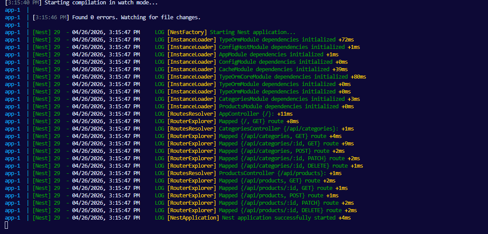
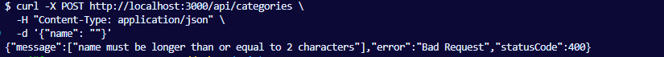
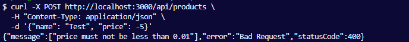
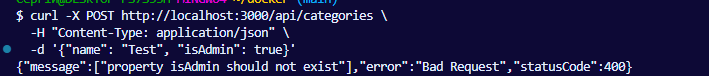
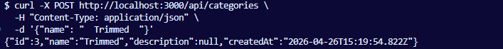
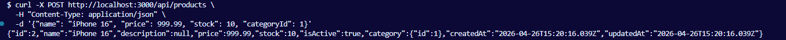

## Student
- Name: Тринька Сергій
- Group: 232.1
 
## Практичне заняття №4 — DTO + class-validator + Pipes
 
### Структура репозиторію
```
.
├── src/
│   ├── categories/
│   │   ├── dto/
│   │   │   ├── create-category.dto.ts
│   │   │   └── update-category.dto.ts
│   │   ├── category.entity.ts
│   │   ├── categories.module.ts
│   │   ├── categories.service.ts
│   │   └── categories.controller.ts
│   ├── products/
│   │   ├── dto/
│   │   │   ├── create-product.dto.ts
│   │   │   └── update-product.dto.ts
│   │   ├── product.entity.ts
│   │   ├── products.module.ts
│   │   ├── products.service.ts
│   │   └── products.controller.ts
│   ├── common/
│   │   └── pipes/
│   │   	└── trim.pipe.ts
│   ├── migrations/
│   ├── data-source.ts
│   ├── main.ts
│   └── app.module.ts
├── Dockerfile
├── docker-compose.yml
└── README.md
```
 
### Запуск проекту
```bash
cp .env.example .env
docker compose up --build
```

### Тест валідації — порожнє ім'я категорії
```text
<вивід curl POST /api/categories з {"name": ""}>
```
 
### Тест валідації — від'ємна ціна продукту
```text
<вивід curl POST /api/products з {"name": "Test", "price": -5}>
```

### Тест валідації — зайве поле
```text
<вивід curl POST /api/categories з {"name": "Test", "isAdmin": true}>
```
 
### Тест TrimPipe
```text
<вивід curl POST /api/categories з {"name": "  Trimmed  "}>
```

### Тест валідне створення продукту
```text
<вивід curl POST /api/products з валідними даними>
```
