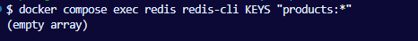

## Student
- Name: <Тринька Сергій>
- Group: <232.1>
 
 
## Практичне заняття №7 — Redis + Pagination + Filtering
 
### Запуск проекту
```bash
cp .env.example .env
docker compose up --build
docker compose run --rm app npm run seed
```
 
### API: GET /api/products
 
| Параметр | Тип | Default | Опис |
|----------|-----|---------|------|
| page | number | 1 | Номер сторінки |
| pageSize | number | 10 | Елементів на сторінку (max 100) |
| sort | string | createdAt | Поле сортування |
| order | asc/desc | desc | Напрямок |
| categoryId | number | - | Фільтр за категорією |
| minPrice | number | - | Мінімальна ціна |
| maxPrice | number | - | Максимальна ціна |
| search | string | - | Пошук за назвою (ILIKE) |
 
### Тест пагінації
```text
<вивід curl GET /api/products?page=1&pageSize=5>
```

### Тест фільтрації
```text
<вивід curl GET /api/products?categoryId=1&minPrice=500>
```

### Тест пошуку
```text
<вивід curl GET /api/products?search=mac>
```

### Тест кешування (Redis)
```text
<вивід docker compose exec redis redis-cli KEYS "products:*">
```

### Тест інвалідації кешу
```text
<Redis KEYS до та після POST /api/products>
```


